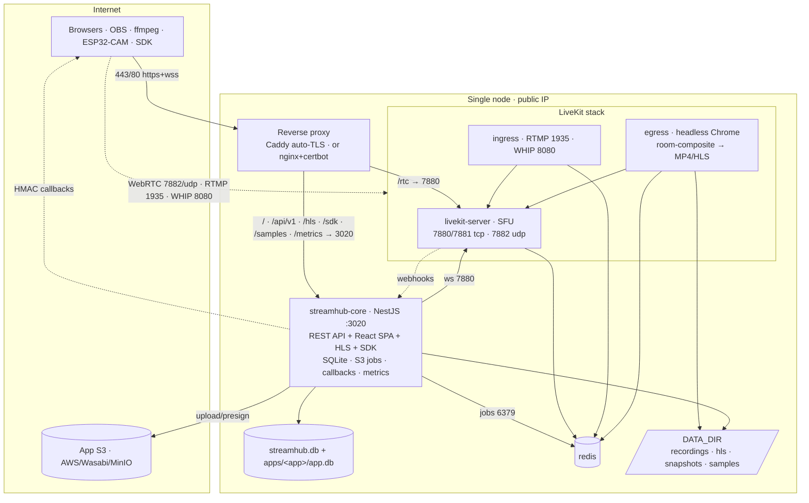

# StreamHub — Architecture (overview)

StreamHub is a **management layer over a self-hosted [LiveKit](https://livekit.io) SFU** that
makes a plain LiveKit deployment behave like AntMedia: tenancy by **apps**, per-app S3
recording, its own REST API (global + per-app), embeddable players + a browser SDK, adaptive
transcoding, structured logs, snapshots, signed callbacks, RBAC + quotas and Prometheus
metrics — behind a **single domain** with automatic TLS.

This file is the top-level map. The **full, diagrammed architecture** lives in
[`streamhub-docs/architecture/`](./streamhub-docs/architecture/README.md); operations
runbooks live in [`streamhub-docs/operations/`](./streamhub-docs/operations/README.md).

> **Naming:** product = **StreamHub**; repo = `vision-media-server`.

## Single node (today)

**Ports:** 80/443 (proxy), 7880/7881 tcp + 7882 udp (LiveKit media), 1935 (RTMP), 8080
(WHIP), 3478 udp (embedded TURN, optional), 3020 (core, local), 6379 (redis, local).

**Processes:** `livekit`, `ingress`, `egress`, `redis`, `streamhub-core` (Node; serves API +
compiled React SPA + HLS + SDK + samples + `/metrics` — the old Laravel UI was removed). Two
deploy shapes: **Docker Compose + Caddy** (default) or **systemd + nginx + certbot**
(plain-server). Details → [architecture/services.md](./streamhub-docs/architecture/services.md).

## Data — per-app SQLite

A **minimal global** `data/streamhub.db` (tenants, users, memberships, quotas, api_tokens,
`nodes` cluster registry, `apps` pointer, server_logs) + **one `apps/<app>/app.db` per app**
owning all app-scoped state (streams, vods, ingress_auth). The global→per-app **split
migration** runs idempotently at boot after a `VACUUM INTO` backup of the global DB. Full ERD
+ flow → [architecture/data-model.md](./streamhub-docs/architecture/data-model.md).

## Target cluster (origin + edge)

Single-node today; designed for an **origin (master) + edge** cluster: a `nodes` registry +
**join by cluster-token + IP**, WebRTC **session affinity** (LiveKit pins a room to one node
via shared redis), a control-plane **router**, and pooled ingress/egress workers.
**Reality check:** WebRTC does not scale to 100k+ viewers — the design pairs **origin WebRTC
(interactive)** with **LL-HLS + CDN (mass audience)**. Full design →
[architecture/cluster.md](./streamhub-docs/architecture/cluster.md).

## Observability

streamhub-core exposes Prometheus at `/metrics` (root path; optional `METRICS_TOKEN`);
LiveKit exposes its own native metrics (`prometheus_port`). Prometheus scrapes both, Grafana
on top. Catalog + setup →
[operations/OBSERVABILITY.md](./streamhub-docs/operations/OBSERVABILITY.md).

## See also

- Operations: [DEPLOY](./streamhub-docs/operations/DEPLOY.md) ·
  [RUNBOOK](./streamhub-docs/operations/RUNBOOK.md) ·
  [ENV](./streamhub-docs/operations/ENV.md)
- API & config: [`streamhub-docs/`](./streamhub-docs/README.md)
