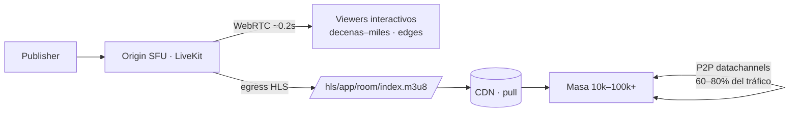
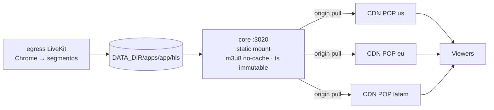
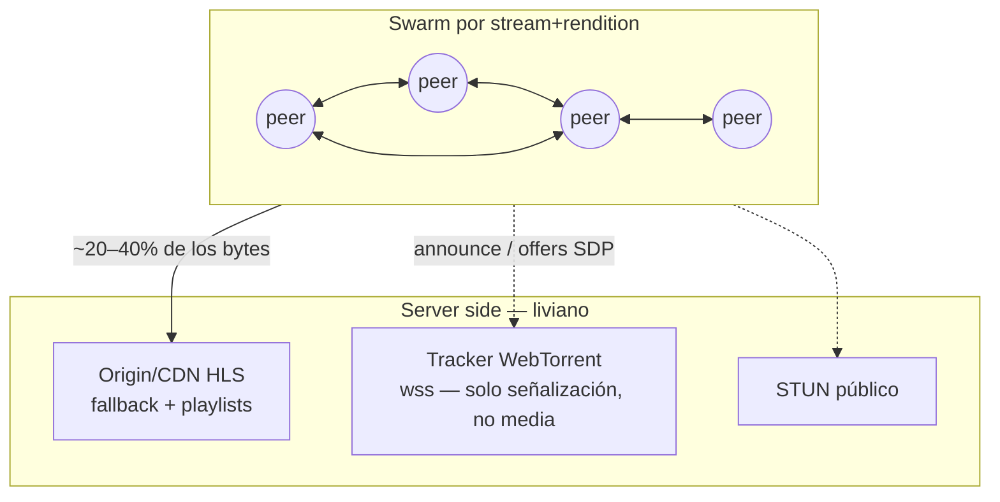

# Distribución y escala — CDN · edges · P2P (investigación + plan)

> **Objetivo.** Cómo lleva StreamHub un stream a **cientos de miles de espectadores** sin
> reventar el servidor, compitiendo contra AntMedia EE. Este doc define los **tres modos de
> distribución configurables por app** (CDN / solo-edges / P2P), la entrega de **VOD adaptativo**
> a escala, la **matriz de decisión** por caso de uso, el **modelo de config** y un **roadmap
> honesto** para un equipo chico.
>
> **Realidad hoy:** 1 nodo (8c/8GB VPS), LiveKit SFU (WebRTC p50 **193 ms**), HLS por egress
> (~**15 s**, bajable a ~6–8 s — matriz [B1](../features/ANTMEDIA-APP-SETTINGS-MATRIX.md)),
> grabación→S3, módulo `cluster` (registry `nodes` + join por API) **diseñado pero no
> multi-nodo en vivo**. Ver [cluster.md](./cluster.md) y
> [LATENCY-TUNING.md](../operations/LATENCY-TUNING.md).

---

## 0. El modelo mental — por qué existen tres modos

La física del problema, en números:

| Path | Costo por viewer | Cacheable por terceros | Latencia | Escala natural |
|---|---|---|---|---|
| **WebRTC (SFU)** | Alto — cada viewer es una suscripción que el SFU sirve individualmente (CPU crypto/pacing + NIC) | ❌ nunca | ~0.2 s | cientos–miles por nodo |
| **HLS servido por el nodo** | Bajo en CPU, pero la **NIC es el techo** | ✅ (HTTP plano) | 6–15 s | miles por nodo |
| **HLS + CDN** | Casi nulo para el origin (el CDN paga el fan-out) | ✅✅ | 6–15 s (LL-HLS ~3 s, no disponible hoy) | ilimitada, costo lineal en GB |
| **HLS + P2P** | Los viewers se sirven entre sí; el origin/CDN cubre el resto | ✅ + mesh | +1–2 segmentos sobre HLS | ilimitada, costo **sub**-lineal |

**Cuenta rápida que manda sobre todo lo demás:** 100.000 viewers a 2.5 Mbps (720p) son
**250 Gbps sostenidos** ≈ **112 TB/hora**. Ningún nodo — ni ningún cluster razonable para un
equipo chico — sirve eso directo. La única arquitectura viable a esa escala es
**SFU para el núcleo interactivo + HLS cacheable para la masa + (CDN y/o P2P) pagando el
fan-out**. Es exactamente el reality-check de [cluster.md](./cluster.md), acá aterrizado en
modos configurables.



Los tres modos **no son excluyentes**: `hybrid` (CDN + P2P encima) es el modo para eventos
masivos.

---

## 1. Modo `cdn` — HLS detrás de un CDN

### 1.1 Cómo funciona con lo que ya existe

StreamHub ya produce HLS live en disco y lo sirve con **los headers correctos para CDN**
(ver [hls-live.md](../features/hls-live.md)): `.m3u8` con `no-cache`, segmentos `.ts`
`immutable` + long-cache, CORS abierto, ruta pública `https://<host>/hls/<app>/<room>/index.m3u8`.
Como el playlist referencia segmentos con **URIs relativas**, un CDN en modo *pull* delante
del host **funciona sin tocar código**: el player pide todo al dominio del CDN y las URIs
relativas resuelven contra ese mismo dominio.



### 1.2 Pull vs push

| | **Pull (recomendado)** | **Push (HLS a S3/Storage, CDN delante del bucket)** |
|---|---|---|
| Setup | Crear pull-zone/distribution con origin = `PUBLIC_BASE_URL`. Cero código. | Subir cada segmento al bucket apenas se escribe (watcher o `hlsHttpEndpoint`-style). Requiere código nuevo. |
| Latencia extra | ~0 (el CDN pide on-miss) | +0.5–1 duración de segmento (upload antes de estar disponible) |
| Acople al nodo | El nodo debe estar vivo y alcanzable (es el origin) | Viewers desacoplados del nodo; el nodo puede caerse y el CDN sigue sirviendo la ventana |
| Ancho de banda del origin | ~1 copia por segmento por POP (con Origin Shield: ~1 copia total) | 1 upload por segmento, independiente de audiencia |
| Cuándo | Default para live | Streams críticos 24/7, origin con NIC chica, o multi-CDN |

**V1 = pull.** Push queda como evolución para desacoplar viewers del nodo (útil también como
paso previo a LL-HLS externo).

### 1.3 TTLs y protección del origin

| Objeto | Header origin (ya emitido) | TTL en CDN | Nota |
|---|---|---|---|
| `.m3u8` live | `no-cache` | **1 s** (override en el CDN) + request collapsing | 1 s de TTL colapsa miles de req/s en ~1 req/s por POP sin sumar latencia perceptible (el playlist rota cada `segment_seconds`) |
| `.ts` / `.m4s` | `immutable, max-age=31536000` | respetar origin | Nombres únicos por segmento → cache perfecto |
| `master.m3u8` VOD | (gap — ver §2) | horas | |

Palancas del lado CDN: **Origin Shield** (CloudFront/Fastly/Bunny lo ofrecen) para que el
origin reciba ~1 request por segmento en total, y **request collapsing** (Fastly nativo;
CloudFront lo hace por POP) para los `.m3u8`. Con eso, **un solo nodo 8c/8GB aguanta como
origin de un evento de 100k** — el origin sirve kilobytes por segundo, el CDN sirve los
250 Gbps.

### 1.4 Proveedores y costos (relevado 2026)

Precios lista, NA/EU, sin contrato. El detalle clave para HLS: los **segmentos generan
muchísimos requests** (~900 seg-req + ~1800–3600 playlist-req por viewer/hora), y algunos
CDNs cobran por request.

| CDN | $/GB (primer tier) | $/requests | LL-HLS | Notas para StreamHub |
|---|---|---|---|---|
| **Bunny** | **$0.005–0.01** | no cobra | sí (pass-through) | Mejor $/GB de los mainstream; pull-zone en 5 min; Origin Shield; opción Storage+pull para modo push. **Default recomendado.** |
| **Cloudflare** | plan fijo (bundled) | no cobra | sí | Barato a bajo volumen; para video "serio" empujan a Stream (otro producto); cuidado con ToS de video en planes básicos — usar R2+CDN para VOD (egress $0). |
| **CloudFront** | $0.085 (baja por tiers a ~$0.02 con volumen) | **$0.01/10k HTTPS** | sí | Integración natural con S3 (OAC) para VOD; los requests suman: un evento 100k puede agregar ~$300–500/h solo en requests. Con contrato (savings plan) el $/GB baja fuerte. |
| **Fastly** | $0.12 | $0.0075/10k | sí + request collapsing excelente | El más caro lista; su fuerte es config programable (VCL) y colapso de requests — overkill para arrancar. |

**Costo de un evento de 1 hora** (720p ~2.5 Mbps ≈ 1.1 GB/viewer/h, precios lista):

| Audiencia | GB/h | Bunny | CloudFront (blended) | CDN + P2P al 70% (Bunny) | Solo edges propios |
|---|---|---|---|---|---|
| 1.000 | ~1.1 TB | ~$6 | ~$95 | ~$2 | 1–3 nodos |
| 10.000 | ~11 TB | ~$56 | ~$900 | ~$17 | ~10 nodos 10G o 30+ de 1G — no razonable |
| 100.000 | ~112 TB | ~$560 | ~$7.500–8.500 (+requests) | ~**$170** | no viable |

### 1.5 Clústeres (origin+edge) + CDN encima

El CDN necesita **un origin estable** por app; el HLS de un room vive en el nodo donde corre
su egress. Composición con el cluster de [cluster.md](./cluster.md):

1. **V1 (1 nodo):** origin del CDN = el nodo. Nada más.
2. **V2 (cluster):** origin del CDN = **el master**, que hace **proxy interno** de
   `/hls/<app>/<room>/*` al nodo dueño del room (el router ya sabe la afinidad room→node del
   registry). Un `proxy_cache` corto en el master actúa de shield adicional. El CDN nunca se
   entera de la topología interna.
3. **V3 (multi-región):** modo push a S3/Storage por región + CDN multi-origin con failover,
   o un CDN por región con `cdn.base_url` distinto por app. Recién tiene sentido con tráfico
   real multi-región.

Los **edges siguen teniendo rol con CDN**: sirven el núcleo **WebRTC interactivo** cerca del
cliente (la palanca #1 de latencia según
[LATENCY-TUNING.md](../operations/LATENCY-TUNING.md)) y pueden actuar de origin regional.

### 1.6 Qué cambios requiere (código/config)

| Cambio | Estado | Esfuerzo |
|---|---|---|
| Servir HLS con headers cache-friendly | ✅ ya está (static mount) | — |
| URIs relativas en playlist | ✅ ya está (egress) | — |
| `distribution.cdn.base_url` por app → `playlistUrl`/`playUrl` devuelven el dominio CDN en vez de `PUBLIC_BASE_URL` | ❌ (hoy `PUBLIC_BASE_URL` global; `s3.public_url` ya existe para VOD — patrón a replicar) | **S** — plumbing de config + armado de URLs en hls-live/tokens/players |
| `Cache-Control` en objetos S3 de VOD (`s3.cache_control`) | ❌ | **S** — quick-win A2 de la [matriz](../features/ANTMEDIA-APP-SETTINGS-MATRIX.md) |
| `hls.segment_seconds` / `list_size` al egress (latencia 15s→6–8s y menos req de playlist) | ❌ | **M** — B1 de la matriz |
| Push de segmentos a S3 (modo push) | ❌ | **M** — watcher/upload; solo si hace falta desacoplar |
| Signed URLs de CDN (playback privado vía CDN) | ❌ | **M** — hoy el HLS es público; ver §1.7 de seguridad en P2P |

---

## 2. Modo `edge` — solo el cluster, sin CDN

Distribución 100% con fierros propios: WebRTC para interactivos + HLS servido por los edges.

### 2.1 Techo realista por nodo

Estimaciones para el perfil actual (8c/8GB) — la **NIC manda** en casi todos los casos:

| Path | Límite dominante | Nodo 1 Gbps | Nodo 10 Gbps (8c) |
|---|---|---|---|
| **WebRTC** (subs @2.5 Mbps) | NIC primero; CPU (crypto/pacing/estado SFU) topa ~1–1.5k subs en 8c | **~300–400** | ~1.000–1.500 (CPU-bound) |
| **WebRTC** (subs @1 Mbps, capa media simulcast) | idem | ~800 | ~1.500 |
| **HLS estático** (@2.5 Mbps) | NIC (CPU trivial: es `sendfile`) | **~320** | ~3.500–4.000 |

Notas honestas:

- El fan-out **origin→edges** es barato (una copia del ladder por edge), el costo está en el
  **edge→viewers**. Escalar sin CDN = **agregar nodos linealmente** + balancear viewers.
- Para HLS en edges **no hace falta correr un egress por edge** (cada egress es un Chrome,
  ~1–2 cores): el egress corre **una vez** en el nodo del room; los edges hacen
  **`proxy_cache` HTTP del origin** — un nginx con dos directivas o un módulo proxy en el
  core. Es la forma barata y correcta.
- 10k viewers @2.5 Mbps = 25 Gbps = ~3–4 nodos 10G bien ubicados **solo si la audiencia es
  regional**; multi-región sin CDN implica flota + geo-DNS + on-call: no es terreno de equipo
  chico.

### 2.2 Cuándo alcanza

- **CCTV / monitoreo / QC** — decenas de viewers, latencia sub-segundo: WebRTC directo, hoy ya funciona.
- **Interactivo mediano** (aulas, subastas, live-shopping con pocos miles): 1 origin + 1–3
  edges WebRTC en región cubren 1–4k viewers interactivos.
- **Requisitos de soberanía / red cerrada** (gobierno, intranet corporativa, venues): el CDN
  no es opción; edges es EL modo.
- **HLS hasta ~2–5k viewers regionales** con 1–2 edges 10G.

Arriba de eso, el modo `edge` pierde contra CDN en costo, operación y alcance geográfico.

### 2.3 Qué requiere

Todo es **incremental sobre el cluster ya diseñado** ([cluster.md](./cluster.md)): registry +
join ya existen; falta (a) LiveKit multi-node en vivo (redis compartido + keys + IP externa),
(b) el **router de viewers** (elegir edge por carga/región al mintear el token o resolver el
playlist), (c) el `proxy_cache` HLS en edges. Los heartbeats del registry ya llevan `stats`
para la decisión de balanceo.

---

## 3. Modo `p2p` — los viewers se distribuyen entre sí

**La palanca clave para "cientos de miles sin reventar el server" (y sin factura CDN
proporcional).** Es el enfoque de Peer5 (comprada por Microsoft), Streamroot (Lumen) y
CDNBye/SwarmCloud — pero con una lib open-source madura:
**[P2P Media Loader](https://github.com/Novage/p2p-media-loader)** (Novage, Apache-2.0,
TypeScript).

### 3.1 Cómo funciona

Cada viewer descarga segmentos HLS **de otros viewers** por **WebRTC DataChannels** y solo va
al CDN/origin cuando el swarm no tiene el segmento (o para el playlist, que siempre es HTTP).
El descubrimiento de peers usa el **protocolo de trackers WebTorrent** sobre WebSocket.



- **swarmId** = identificador del contenido (proponemos `<app>/<room>/<rendition>`): peers del
  mismo stream y calidad se encuentran entre sí.
- El tracker **no toca media**: solo empareja peers (announce + intercambio de ofertas SDP).
  Carga por peer: un WS y mensajes esporádicos.

### 3.2 Ahorro real y trade-offs (honesto)

| Aspecto | Realidad |
|---|---|
| **Ahorro de banda** | Novage documenta "hasta 80% de tráfico CDN"; el techo teórico con swarms de 10 peers es ~90% (cada segmento entra 1 vez por HTTP). En producción con audiencias masivas y buffer bien configurado: **50–75% en live es un rango defendible**; 60–90% solo en eventos muy grandes y homogéneos. Con pocos viewers (<10 por swarm) el ahorro tiende a 0 — por eso el fallback HTTP es siempre obligatorio y el modo es *hybrid* por naturaleza. |
| **Latencia** | El P2P necesita **ventana de buffer** para que los segmentos circulen: suma ~1–2 duraciones de segmento sobre el HLS base. Con nuestro HLS actual (15 s, bajando a 6–8 s con B1) el fit es **perfecto** — el P2P brilla justo en el rango 10–30 s. **Incompatible con LL-HLS sub-3s** (el share P2P se derrumba): no perseguir ambas cosas en el mismo stream. |
| **Player** | Integra con **hls.js** y Shaka (+ wrappers Vidstack, Clappr, Plyr, DPlayer…). ⚠️ **Corrección de supuesto:** nuestro player HLS actual usa **video.js v8 con VHS** (`streamhub-web/src/components/player/HlsPlayer.tsx`), NO hls.js. Para P2P hay que mover el path HLS del player público a **hls.js** (mejor control de live-sync, bundle menor, y es el engine que el ecosistema P2P asume). Es un cambio contenido: `/play` + `HlsPlayer`. |
| **Server** | Un **tracker** self-hosted (los públicos "no usar en producción" — palabra de los autores) + STUN (públicos alcanzan; los peers están en browsers domésticos, TURN no aplica al mesh — peer sin UDP simplemente cae a HTTP). |
| **Clientes** | Chrome/Firefox/Edge/Safari desktop y Android; **iOS Safari ≥17.1** (Managed MSE). En celular conviene `disable_on_cellular` (datos + batería). Peers detrás de NAT simétrico aportan menos — el fallback lo cubre. |
| **Seguridad/privacidad** | Los segmentos se comparten entre viewers: OK para streams **públicos** (el HLS de StreamHub hoy es público). Si después llega `playback_security` (matriz B4) o DRM, **P2P se apaga para esa app** — no mezclar. |

### 3.3 Integración concreta

Paquetes: `p2p-media-loader-core` + `p2p-media-loader-hlsjs` (npm). El engine se inyecta como
mixin de la clase `Hls`:

```ts
import Hls from 'hls.js';
import { HlsJsP2PEngine } from 'p2p-media-loader-hlsjs';

const HlsWithP2P = HlsJsP2PEngine.injectMixin(Hls);

const hls = new HlsWithP2P({
  p2p: {
    core: {
      swarmId: `${app}/${room}`,                       // peers del mismo stream
      announceTrackers: cfg.p2p.trackers,               // wss del tracker propio
      // rtcConfig.iceServers: STUN (default público OK)
    },
    onHlsJsCreated: (h) => {
      h.p2pEngine.addEventListener('onChunkDownloaded', reportStats); // p2p vs http
    },
  },
});
hls.loadSource(playlistUrl);
```

**Tracker — reusar el WS existente o sidecar.** El core no tiene un WS propio (la señalización
WS es de LiveKit), así que "reusar el WS" significaría implementar el protocolo tracker como
gateway Nest. Recomendación honesta: **no** al principio. Correr un tracker probado como
sidecar en el compose y rutearlo por Caddy/nginx (`/tracker` → wss):

- **[wt-tracker](https://github.com/Novage/wt-tracker)** (Novage, uWebSockets.js): decenas de
  miles de peers en 1 vCPU/256MB. Alcanza hasta ~50–100k concurrentes.
- **[Aquatic](https://github.com/greatest-ape/aquatic)** (Rust): el paso siguiente para
  cientos de miles; benchmarks de millones de announces.

```yaml
# docker-compose (sidecar) — infra nueva total: 1 contenedor chico
tracker:
  image: novage/wt-tracker        # o build propio
  restart: unless-stopped
# Caddy:  handle /tracker* { reverse_proxy tracker:8000 }
```

Un gateway tracker nativo en Nest (mismo puerto 3020, cero contenedor extra) queda como
mejora opcional posterior — el protocolo es simple (announce/offer/answer JSON sobre WS) y
testeable, pero no es el camino corto.

**Métricas.** El engine emite eventos de bytes por fuente (p2p vs http): reportarlos a un
endpoint liviano del core → `streamhub_p2p_bytes_total{source="p2p|http", app=...}` en
Prometheus. Sin esto no se puede demostrar el ahorro (y es el número de venta contra
AntMedia, que **no tiene P2P**).

---

## 4. VOD adaptativo a escala (distribución)

La **generación** del ladder VOD (master `index.m3u8` multi-rendition + renditions) la está
armando el agente de transcoding; acá va la **distribución**:

1. **Todo el árbol HLS del VOD vive en S3** bajo `s3.prefix` (igual que hoy MP4/snapshots) con
   URIs **relativas** en los playlists → el árbol es portable a cualquier base URL.
2. **`Cache-Control` en el upload** (quick-win A2): renditions/segmentos
   `public, max-age=31536000, immutable`; `master.m3u8` `max-age=3600` (un VOD publicado no
   muta; si se re-transcodifica, cambia el prefijo/versión del key).
3. **CDN delante del bucket** — tres recetas según proveedor:
   - **CloudFront + S3 OAC**: bucket privado, el CDN firma el acceso; transferencia S3→CF $0.
   - **Bunny pull-zone → endpoint S3/Wasabi**: el más simple con Wasabi (que ya usamos).
   - **Cloudflare R2 + CDN**: **egress $0** — para catálogos VOD con mucho replay es la
     opción de costo estructuralmente menor.
4. **URL pública**: ya existe el patrón — `s3.public_url` construye URLs determinísticas
   `<publicUrl>/<objectKey>` en vez de presigned (`S3Config.publicUrl`,
   `vods.publicUrl`). **`public_url` = dominio del CDN y el VOD ya sale por CDN.** El gap real
   es solo el `Cache-Control` del punto 2 (hoy los objetos suben sin él → hit-ratio pobre).
5. **VOD privado**: presigned URLs (ya existe) no cachean bien; si hace falta privado + CDN →
   signed URLs/cookies del CDN (fase posterior).
6. **P2P en VOD**: P2P Media Loader también hace VOD — swarms por título; para catálogos con
   picos (estrenos) suma, con el mismo player hls.js. Prioridad menor que live.

---

## 5. Matriz de decisión — qué modo para qué caso

| Caso | Audiencia | Modo | Latencia | Costo | Complejidad |
|---|---|---|---|---|---|
| **CCTV / monitoreo / QC** | 1–20 | `edge` (WebRTC puro) | ~0.2 s | ya pagado | ninguna (hoy funciona) |
| **Live-shopping / subasta 1→N** | 100–5k | `hybrid`: WebRTC para host+VIPs interactivos, HLS+CDN para el resto | 0.2 s / 6–15 s | CDN ~$6–60/h | baja (F1) |
| **Clase / webinar interactivo** | 50–500 | `edge` (WebRTC, edge en región) | ~0.2 s | 1 nodo extra | media (cluster vivo) |
| **Evento regional** | 1k–10k | `cdn` | 6–15 s | ~$6–56/h (Bunny) | baja |
| **Evento masivo** | 50k–500k | `hybrid` = `cdn` + `p2p` | 10–20 s | ~$170/h @100k (70% P2P) | media-alta (F3) |
| **Radio / audio 24/7** | miles | `cdn` (audio ≈ 15× más barato que video) o `p2p` | 6–15 s | decenas de $/mes | baja |
| **Red cerrada / soberanía** | variable | `edge` obligado | 0.2 s / 6 s | fierros propios | media |
| **VOD catálogo** | long tail | S3+CDN (`public_url`), +P2P en picos | n/a | $/GB CDN o R2 $0 | baja (F0) |

Regla simple: **interactivo → WebRTC/edges; masivo → HLS/CDN; masivo y recurrente → +P2P.**
Y del reality-check de [cluster.md](./cluster.md): **nunca** WebRTC para la masa.

---

## 6. Modelo de config propuesto (per-app `config.yaml`)

Sub-bloque nuevo `distribution`, opcional, defaults seguros (misma filosofía del
[config-reference](../config-reference.md): config inválida nunca crashea, cae a defaults).
Convive con el bloque `hls:` propuesto en la matriz B1.

```yaml
distribution:
  mode: edge                # edge | cdn | p2p | hybrid   (default: edge = comportamiento actual)

  cdn:
    base_url: ""            # ej. https://live-demo.b-cdn.net — pull-zone cuyo origin es PUBLIC_BASE_URL.
                            # Si está seteado (y mode incluye cdn), playlistUrl/playUrl del HLS live
                            # se arman con este dominio en vez de PUBLIC_BASE_URL.
    vod_base_url: ""        # CDN delante del bucket S3 para VOD. Default: s3.public_url (ya existente).
    provider: generic       # generic | bunny | cloudfront | cloudflare | fastly (informativo/UI)
    signed_urls: false      # reservado — playback privado vía CDN (fase posterior)

  p2p:
    enabled: false          # requiere HLS público (incompatible con playback_security futuro)
    trackers:               # tracker(es) WebTorrent-compatibles propios. VACÍO = P2P off
      - "wss://streamhub.example.com/tracker"
    swarm_prefix: ""        # default: <app>. swarmId efectivo: <prefix>/<room>
    max_peers: 30           # límite de conexiones por peer
    disable_on_cellular: true

hls:                        # (matriz B1 — el knob de latencia del path de escala)
  segment_seconds: 4
  list_size: 10
```

**Cómo lo consume el sistema:**

- `POST .../hls/start` y `GET .../hls` devuelven `playlistUrl` con `cdn.base_url` si aplica
  (hoy usan `PUBLIC_BASE_URL` — [hls-live.md](../features/hls-live.md)).
- La página pública `/play` y los tokens (`playUrl`/`embedUrl`) leen `distribution` para:
  elegir path (WebRTC vs HLS), apuntar al CDN, e inicializar el engine P2P con
  `trackers`/`swarmId` (expuesto por el endpoint público sanitizado que ya existe para
  overlays).
- `mode` decide el default del player; el operador puede forzar por stream vía query
  (`?path=webrtc|hls`) como override puntual.
- Editable vía `GET/PATCH /apps/{app}/config` + UI (misma mecánica que `webrtc.layers`).

---

## 7. Roadmap por fases (esfuerzo honesto, equipo chico)

| Fase | Qué | Esfuerzo | Código vs infra | Desbloquea |
|---|---|---|---|---|
| **F0 — CDN sin código** | Crear pull-zone (Bunny) con origin = host actual; validar playback vía CDN; runbook. + `s3.cache_control` en uploads VOD (A2) | **1–2 días** | infra: cuenta CDN (~$10 para probar) · código: S | Eventos de 1k–10k **ya** |
| **F1 — `distribution` config** | Bloque YAML + `cdn.base_url` cableado a `playlistUrl`/`playUrl`/`/play` + UI + tests | **3–5 días** | solo core | CDN por-app self-service; el modo `cdn` queda formal |
| **F2 — HLS tuning** | `hls.segment_seconds`/`list_size` al egress (B1): 15 s → ~6–8 s; menos requests de playlist | **3–5 días** | core + params egress (M) | Mejor UX live masivo; base para P2P |
| **F3 — P2P** | Player público → hls.js; `p2p-media-loader-hlsjs`; sidecar `wt-tracker` tras Caddy; config `p2p.*`; métricas `p2p_bytes_total`; kill-switch | **2–3 semanas** | core+web+1 contenedor | **La palanca de 100k+**: ahorro 50–75% de CDN, diferencial vs AntMedia |
| **F4 — Edges sirviendo** | Cluster en vivo (LiveKit multi-node, ya diseñado) + `proxy_cache` HLS en edges + router de viewers por carga/región | **2–4 semanas** | core + VMs nuevas | Modo `edge` real; WebRTC interactivo cerca del cliente (palanca #1 de latencia) |
| **F5 — 100k readiness** | Origin Shield + push-a-S3 opcional; Aquatic si el tracker satura; ensayo de carga; contrato CDN por volumen; (LL-HLS: **L**, requiere reemplazar el pipeline HLS del egress — no bloquea: P2P quiere 6–15 s igual) | continuo | infra + contratos | Eventos 100k+ con costo y riesgo conocidos |

**Notas de honestidad:**

- F0–F2 las hace **una persona en ~2 semanas** y ya habilitan eventos de decenas de miles con
  costo CDN puro (~$56/h @10k). Es el 80% del valor con el 20% del esfuerzo.
- F3 (P2P) es el mejor ROI siguiente: 1 contenedor nuevo + trabajo de player. El riesgo es de
  **QA de player** (matriz de browsers/mobile), no de backend. Presupuestar el kill-switch
  por app desde el día 1.
- F4 es la fase más cara operacionalmente (flota, on-call) y **no** es prerequisito de la
  escala masiva — CDN+P2P escalan sin ella. Se justifica por latencia interactiva regional y
  por clientes de red cerrada.
- **Qué NO hacer:** WebRTC para la masa; tracker custom en Nest el día 1; LL-HLS+P2P en el
  mismo stream; multi-CDN antes de tener un CDN.

## 8. Observabilidad de la distribución

Sumar al catálogo de [OBSERVABILITY.md](../operations/OBSERVABILITY.md):
`streamhub_p2p_bytes_total{source,app}` (ratio P2P), `streamhub_hls_origin_requests_total`
(salud del shield: si sube, el CDN no está colapsando), hit-ratio del CDN (API/logs del
proveedor), y por nodo: NIC out Mbps vs techo (la métrica que dispara "agregá un edge").

## 9. Referencias

- [P2P Media Loader (Novage)](https://github.com/Novage/p2p-media-loader) · [FAQ](https://github.com/Novage/p2p-media-loader/blob/main/FAQ.md) · [overview](https://novage.com.ua/p2p-media-loader/overview) — Apache-2.0; hls.js/Shaka; "hasta 80% de ahorro CDN"; trackers self-hosted [wt-tracker](https://github.com/Novage/wt-tracker) / [Aquatic](https://github.com/greatest-ape/aquatic).
- Pricing CDN 2026: [Bunny](https://bunny.net/pricing/) $0.005–0.01/GB sin request-fees; [CloudFront](https://aws.amazon.com/cloudfront/pricing/) $0.085/GB primer tier + $0.01/10k req; [benchmark 12 proveedores](https://blog.blazingcdn.com/en-us/cdn-price-benchmark-comparing-12-providers-by-gb-served).
- [LiveKit egress — SegmentedFileOutput](https://docs.livekit.io/transport/media/ingress-egress/egress/outputs/) (`segment_duration` configurable; sin LL-HLS).
- Internos: [cluster.md](./cluster.md) · [hls-live.md](../features/hls-live.md) · [LATENCY-TUNING.md](../operations/LATENCY-TUNING.md) · [ANTMEDIA-APP-SETTINGS-MATRIX.md](../features/ANTMEDIA-APP-SETTINGS-MATRIX.md) (A2/B1/B4) · [config-reference.md](../config-reference.md) · [vod.md](../features/vod.md).
