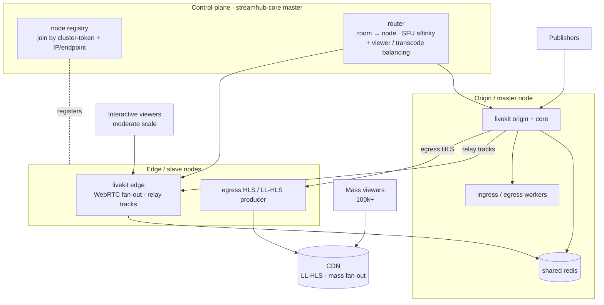
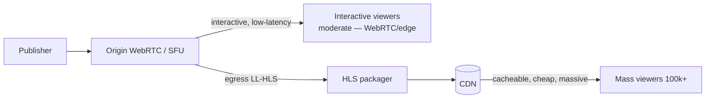

# Architecture — Target cluster (origin + edge)

StreamHub runs **single-node today**. This document is the **target** design for horizontal
scale and the seams already left in the codebase to get there without a rewrite. It also
contains an honest **reality check** on WebRTC vs HLS/CDN for mass audiences — the most
important design decision in this doc.

> Status: the `nodes` registry table and a cluster-aware data model exist; multi-node is
> **not live**. Standing up an edge = provisioning a VM and running the join. Everything
> below marked *target* is design intent.

## Topology

## What LiveKit gives you vs what StreamHub builds

| Concern | LiveKit (free) | StreamHub builds |
|---|---|---|
| **WebRTC session affinity** | LiveKit already pins each **room to a single node** via shared redis. A WebRTC session lives on **one** server — correct by construction. | Nothing extra; we rely on it. The router just needs to know which node owns a room. |
| **Cluster membership** | Peer nodes + shared redis + same API key/secret + node reachable by IP. | A **node registry** (`nodes` table) + a **join by cluster-token + IP/endpoint**: an edge registers its reachable endpoint at join. This is the "link by token + IP". |
| **Transcode scaling** | ingress/egress are workers coordinated via redis. | A **pool** of ingress/egress workers spread across nodes; scale horizontally. Metrics (`streamhub_media_transcode_total`, GPU gauges) tell you where work landed. |
| **Viewer scaling** | SFU fan-out per subscription. | Routing of interactive viewers to edge; **HLS/CDN** for the mass tail (see reality check). |

**Master/edge** is a modeling convenience — LiveKit is peer + redis, not strict
master/slave. We model an **origin** (where publishers land) + **edge** (fan-out / relay) +
a **control-plane** (streamhub-core master) that routes.

## Reality check — WebRTC vs HLS/CDN for the masses

**Do not** serve hundreds of thousands of viewers over WebRTC. Every WebRTC viewer is a
subscription the SFU must individually serve; cost and node count explode roughly linearly.
Edge WebRTC relay helps for **moderate, interactive** audiences (relay tracks origin→edge,
each edge fans out its share) but it is **not** the path to 100k+.

The correct pattern, which StreamHub is designed around:

- **Origin WebRTC** for publishers and the interactive core (sub-second, two-way).
- **LL-HLS via CDN** for the massive, one-way tail — cacheable segments, cost scales with
  CDN not with your SFU. Latency is a few seconds instead of sub-second, which is the right
  trade for broadcast-scale audiences.

StreamHub already produces HLS (`/hls/<app>/<room>/index.m3u8`) from egress today; the
cluster work is putting a CDN in front of it and routing viewers to WebRTC-edge vs HLS by
audience type. **We design both paths and pick per use-case.**

## Making it cluster-ready (no new nodes yet)

Order of work to be "add an edge = run the join" without live multi-node:

1. **Per-app SQLite** (done) — app state travels with the app; the global DB is a small
   shared control-plane store. See [data-model.md](./data-model.md).
2. **Node registry + join** — `nodes` table + a join flow: an edge presents a cluster-token
   and publishes its reachable endpoint/IP; the master records it and can route to it.
3. **LiveKit multi-node config** — shared redis + shared API key/secret + node external IP;
   flip LiveKit to multi-node-ready settings.
4. **Router** — room→node affinity (respect LiveKit's placement), plus viewer/transcode
   balancing and the WebRTC-edge-vs-HLS/CDN decision.

Going **live** multi-node then only requires provisioning VMs and running the join — no data
or schema migration.

## Observability across nodes

Each node exposes streamhub-core `/metrics` and LiveKit's native Prometheus metrics; a
central Prometheus scrapes all nodes, Grafana aggregates. Cluster-relevant signals: per-node
CPU/bandwidth, egress queue depth, relay track counts, S3 upload failures, per-tenant usage
vs quota. See [`../operations/OBSERVABILITY.md`](../operations/OBSERVABILITY.md).

## Node liveness: heartbeat + self-registration

Since installer v2.1.0 the join flow is no longer the node's only "pulse":

- **Heartbeat systemd timer** — `install.sh` provisions
  `/usr/local/bin/streamhub-heartbeat.sh` (POSTs `{nodeId, stats}` to
  `POST /cluster/heartbeat` with `X-Cluster-Token`) plus a
  `streamhub-heartbeat.service`/`.timer` pair (`OnBootSec=30`,
  `OnUnitActiveSec=60` — every 60s), enabled on **both** the origin and every
  joined edge. Previously an edge only "pinged" once, at join time, and went
  `stale=true` after 90s with nothing re-arming it (worked around manually in
  early cluster tests with a cron entry — the installer now ships the timer,
  so that workaround is obsolete).
- **Origin self-registration** — `ClusterService` upserts a fixed `id:'origin'`
  row into the `nodes` registry on boot (and keeps it fresh via the same
  heartbeat path), so the origin now shows up in `GET /cluster/nodes` next to
  its edges instead of only edges being visible.
- **Operator status is preserved across heartbeats** — a node an operator sets
  to `draining`/`disabled` via `PATCH /cluster/nodes/:id` used to flip back to
  `active` on its very next heartbeat write (the heartbeat handler
  unconditionally reset `status`). Both the heartbeat write and self-registration
  now special-case `draining`/`disabled` and leave them alone.

## Known limitations (real, observed in cluster testing)

- **`draining` is registry-only.** `PATCH /cluster/nodes/:id {status:'draining'}`
  updates the StreamHub registry, but LiveKit's own room allocator is unaware
  of it — a new room can still land on a node an operator just drained. There
  is no router wired to that status yet (see "Making it cluster-ready" above).
- **Cross-node egress placement can orphan a recording.** Room-composite
  egress (recording, live HLS) is scheduled onto *whichever* node's egress
  worker picks up the job — not necessarily the node serving the room. When
  the claim lands on a different node than the one core queries for the local
  file, the upload/serve step 404s or fails even though the egress itself
  succeeded. This is a structural gap: the real fix is either shared storage
  (NFS/S3-direct egress output) or pinning `StartEgress` to the room's own
  node. Until then, treat recording/HLS on a multi-node cluster as
  best-effort, not guaranteed.
