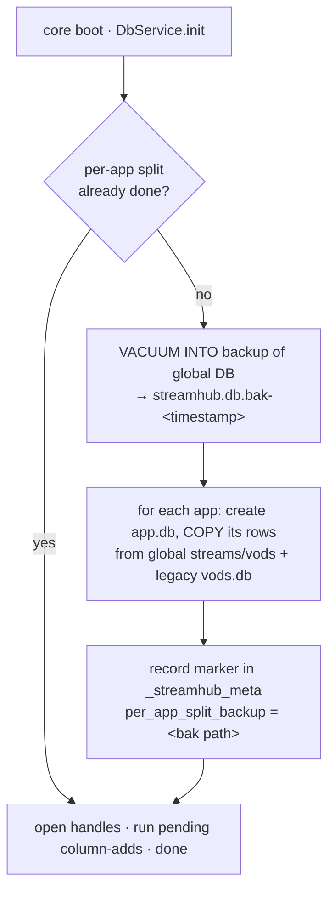

# Architecture — Data model (per-app SQLite)

StreamHub persists with **better-sqlite3** (synchronous, simple, predictable). The model is
deliberately **decentralized, AntMedia-style**: a **minimal global DB** holds only
cross-cutting identity and cluster-routing data, and **each app owns its own SQLite file**
holding *all* of its state. This is both a clean tenancy boundary and the foundation for the
cluster: an app's state travels with the app.

## Two tiers

```mermaid
flowchart LR
  subgraph Global [data/streamhub.db — ONLY cross-cutting state]
    direction TB
    T1[tenants]
    T2[users]
    T3[memberships]
    T4[quotas]
    T5[api_tokens]
    T6[nodes — cluster registry]
    T7[apps — pointer: name, tenant, node]
    T8[server_logs]
  end
  subgraph App ["apps/&lt;app&gt;/app.db — EVERYTHING app-scoped (one file per app)"]
    direction TB
    A1[streams]
    A2[vods + metatags + snapshot_key]
    A3[ingress_auth — RTMP key/password]
  end
  Global -->|apps.name → dir| App
  App -.->|files on disk| FS[/apps/&lt;app&gt;/recordings · hls · snapshots · samples/ · config.yaml/]
```

- **Global `data/streamhub.db`** — identity + routing only, kept small and hot.
- **Per-app `apps/<app>/app.db`** — the app's config-adjacent state. Media artifacts
  (`recordings/`, `hls/`, `snapshots/`, `samples/`) and the app's `config.yaml` live on disk
  under `apps/<app>/`; the DB stores rows/pointers, not blobs.

## Global schema (`data/streamhub.db`)

| Table | Purpose |
|---|---|
| `apps` | App registry / pointer: `name` (unique), `display_name`, `livekit_room_prefix`, tenant, node, `settings_json`, timestamps. The row is a **pointer**; the app's real state lives in its `app.db`. |
| `api_tokens` | Bearer tokens (`sk_…`): `token_hash`, `scope` (`global`\|`app`), optional `app_id`, optional `allowed_ips_json` (IP whitelist), `last_used_at`, `revoked`. |
| `tenants` | Top-level tenant / customer. |
| `users` | Dashboard identities. |
| `memberships` | user × tenant role bindings (RBAC). |
| `quotas` | Per-tenant limits: `maxApps`, `maxConcurrentStreams`, `maxRecordingMinutesMonth`, `maxEgressGbMonth`, `maxStorageGb` (`-1` = unlimited). |
| `nodes` | **Cluster registry**: nodes that have joined (endpoint/IP, role, health). Unused single-node; present so adding an edge is data, not a schema change. |
| `server_logs` | Structured server log sink (also written to rotating files). |
| `_streamhub_meta` | Migration bookkeeping (schema version, split-migration markers, backup path). |

Hot-path indices back the global registry so lookups stay fast under load. Column-add and
tenancy-backfill migrations run idempotently on top of the base tables.

## Per-app schema (`apps/<app>/app.db`)

| Table | Purpose |
|---|---|
| `streams` | Live/finished streams: `stream_id` (unique), `type` (`webrtc`\|`rtmp`\|`rtsp`\|`whip`), `room`, `participant`, `status` (`active`\|`ended`), timings, `last_stats_json` (viewer count etc.). |
| `vods` | Recordings: `stream_id`, `room`, `file_key`, `s3_url`, `public_url`, size/duration/dimensions/format, `status` (`recording`\|`uploading`\|`ready`\|`failed`), `local_path`, `metatags_json`, `snapshot_key`, timings. |
| `ingress_auth` | Per-app RTMP ingress credentials: stream key + optional password (feature-flagged). |
| `_streamhub_meta` | Per-app migration bookkeeping. |

## The split migration (idempotent, with backup)

`streams`, `vods` and `ingress_auth` **historically lived in the global DB** (or a legacy
`apps/<app>/vods.db`). The move to `app.db` is handled by an automatic, idempotent migration
that runs at core boot:

Properties:

- **Backup first.** A single-file consistent backup of the global DB (`VACUUM INTO`) is
  taken **before** anything is touched, saved next to it as `streamhub.db.bak-<timestamp>`;
  the path is recorded in `_streamhub_meta`.
- **Idempotent.** Re-running is safe — a marker in `_streamhub_meta` short-circuits an
  already-migrated DB; `CREATE TABLE IF NOT EXISTS` + copy-if-absent throughout.
- **Non-destructive.** Any legacy `apps/<app>/vods.db` is imported on first open of that
  app's `app.db` and **left in place** as a fallback backup; the global copies remain until
  a later cleanup.
- **Lazy per-app open.** `app.db` handles are opened on demand and cached (one handle per
  app); opening an app runs its `APP_MIGRATIONS` and any legacy import.

Maintenance (`PRAGMA optimize` → `ANALYZE` → `REINDEX` → `VACUUM` → `wal_checkpoint(TRUNCATE)`)
is exposed per DB via the `db-admin` endpoints — see
[`../operations/RUNBOOK.md`](../operations/RUNBOOK.md).

## Why per-app (cluster rationale)

Because each app owns its full state in one file:

- **Tenancy isolation** is physical — an app is a directory you can copy, back up or move.
- **Cluster placement** becomes trivial: to run an app on another node you move/replicate
  `apps/<app>/` (DB + media refs); the global registry just updates the app→node pointer.
- The **global DB stays minimal** (identity + routing), so it can be the single small shared
  control-plane store even as the number of apps and nodes grows.

See [cluster.md](./cluster.md) for how this feeds the origin+edge design.
