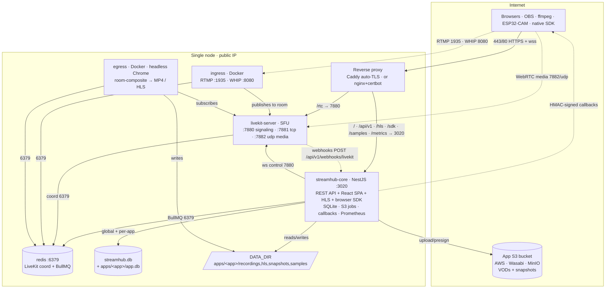

# Architecture — Single-node service map

This is what runs **today**: one Linux host with a public IP. Everything is fronted by a
single reverse proxy on one TLS domain. WebRTC media (UDP) and RTMP ingest bypass the proxy
and hit the server IP directly.

## Service map



## Processes

| Process | What it is | Bind | Managed by |
|---|---|---|---|
| **streamhub-core** | NestJS/TypeScript brain. Serves REST API (`/api/v1`), the React SPA, HLS playlists (`/hls`), the browser SDK (`/sdk`), per-app sample pages (`/samples`) and Prometheus (`/metrics`). | `127.0.0.1:3020` | Docker (`streamhub-core`) or systemd (`streamhub-core.service`) |
| **livekit-server** | The SFU. Signaling + WebRTC media. | `:7880/:7881` tcp, `:7882` udp | Docker (`livekit/livekit-server`) or systemd (`livekit.service`) |
| **ingress** | LiveKit ingress: RTMP push, WHIP, and URL pull (the entry point an RTSP→RTMP relay targets). | `:1935` RTMP, `:8080` WHIP | Docker (`livekit/ingress`) |
| **egress** | LiveKit egress: room-composite recording (headless Chrome) → MP4 / HLS on disk. **Heavy** — roughly one Chrome per recording/HLS session. | host net | Docker (`livekit/egress`) |
| **redis** | LiveKit ingress/egress coordination **and** BullMQ job queues used by core. | `:6379` (local) | Docker (`redis:7-alpine`) or `redis-server` |
| **reverse proxy** | Single TLS vhost. Routes `/rtc`→LiveKit, everything else→core. | `:80/:443` | Caddy (Compose) or nginx+certbot (plain-server) |

### The mono-Node core

Historically the presentation layer was a separate Laravel/Livewire UI. It has been
**removed**: streamhub-core is now a single Node process that serves both the API **and**
the compiled React SPA (`streamhub-web`, Vite + Tailwind) as static assets, plus HLS, the
SDK and sample embeds. One build, one service, one port. The dashboard authenticates with a
break-glass admin login (`POST /api/v1/auth/login` → JWT signed with `STREAMHUB_JWT_SECRET`);
the REST API is guarded by `sk_` bearer tokens.

Core NestJS modules (`src/modules/<name>/`): `apps`, `livekit`, `recording`, `s3`, `auth`,
`authz`, `quotas`, `tenancy`, `streams`, `broadcast`, `transcoding`, `snapshots`, `logs`,
`callbacks`, `samples`, `health`, `system` (GPU/hwaccel detection), `metrics`, `admin`,
`db-admin`. Shared scaffolder-owned pieces live in `src/shared/` (`config`, `db`, `auth`,
`contracts`).

## Ports & firewall

| Port | Proto | Purpose | Exposure |
|---|---|---|---|
| 80, 443 | tcp | Reverse proxy: dashboard, API, `/rtc` signaling, auto-TLS | public |
| 7880 | tcp | LiveKit signaling/API | public (proxied at `/rtc`; direct only if needed) |
| 7881 | tcp | LiveKit WebRTC TCP fallback (ICE/TCP) | public |
| 7882 | udp | LiveKit WebRTC **media** (single mux port) | public |
| 1935 | tcp | RTMP ingest | public |
| 8080 | tcp | WHIP (WebRTC-HTTP ingest) | public |
| 3478 | udp | Embedded TURN (optional; enable with domain+cert) | public |
| 3020 | tcp | streamhub-core | **local only** (proxy target) |
| 6379 | tcp | redis | **local only** |
| 6789 | tcp | LiveKit native Prometheus (if enabled) | local (scraped by Prometheus) |

## Request routing (one domain)

```
https://streamhub.example.com
  /rtc        → livekit-server :7880      (wss signaling / WebRTC upgrade)
  /api/v1/*   → streamhub-core :3020      (REST API, Bearer sk_ / JWT)
  /hls/*      → streamhub-core :3020      (HLS playlists + segments)
  /sdk/*      → streamhub-core :3020      (streamhub-adaptor browser SDK)
  /samples/*  → streamhub-core :3020      (public per-app embed pages, auth-less)
  /metrics    → streamhub-core :3020      (Prometheus, root path, optional token)
  /*          → streamhub-core :3020      (React SPA)
```

WebRTC media (`7882/udp`), RTMP (`1935`) and WHIP (`8080`) are **not** proxied — clients
reach them on the server IP directly.

## Ingest & playback paths

- **Publish:** WebRTC (LiveKit token) · RTMP push · WHIP · RTSP (via an ffmpeg relay to
  RTMP — LiveKit has no native RTSP pull).
- **Playback:** WebRTC (sub-second, interactive) · **HLS** (`/hls/<app>/<room>/index.m3u8`,
  higher latency, scales far better) · embeddable `<iframe>` sample player.
- **Browser SDK:** `streamhub-adaptor` — a drop-in shim of AntMedia's `WebRTCAdaptor` over
  `livekit-client`, served at `/sdk/streamhub-adaptor.global.js`. A missing file simply 404s
  and samples fall back to plain `livekit-client`.

## Deploy shapes

Two supported shapes, same architecture:

1. **Docker Compose + Caddy** (default OSS quick-install): `redis`, `livekit`, `ingress`,
   `egress`, `core`, `caddy`. One `docker compose up -d`; Caddy gets certs automatically.
   LiveKit uses host networking for UDP media + STUN external-IP detection → **Linux host
   with a public IP** (not Docker Desktop on macOS).
2. **systemd + nginx + certbot** (bare-metal / VPS): LiveKit + core as systemd
   units, ingress/egress as Docker containers, redis native, nginx+certbot for TLS.

See [`../operations/DEPLOY.md`](../operations/DEPLOY.md).
